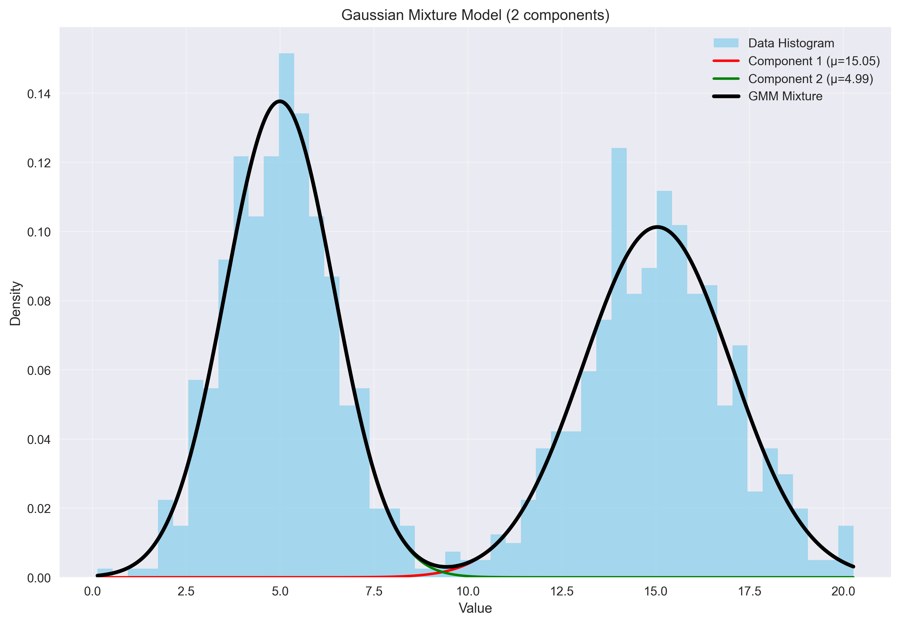
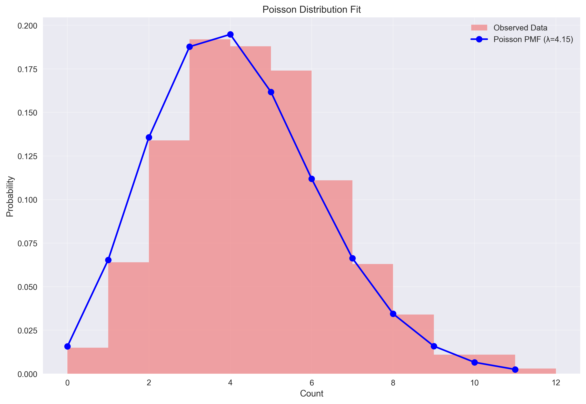

# Parametric Distribution Models

This module demonstrates parametric modeling techniques using Gaussian Mixture Models (GMM) and Poisson distributions with functional programming approach.

## Example Results

### Gaussian Mixture Model


### Poisson Distribution


## Data Requirements

### For Gaussian Mixture Models
- **Data Type**: Continuous numerical data (float/int)
- **Format**: 2D numpy array with shape `(n_samples, 1)`
- **Examples**:
  - Sales amounts: `[25.50, 87.20, 45.30, ...]`
  - Response times: `[0.2, 1.5, 0.8, ...]`
  - Test scores: `[85, 92, 78, ...]`
- **Conversion**: `data.reshape(-1, 1)` if you have 1D array

### For Poisson Distribution
- **Data Type**: Non-negative integers (count data)
- **Format**: 1D numpy array
- **Examples**:
  - Defects per batch: `[2, 0, 3, 1, 4, ...]`
  - Customer arrivals: `[8, 12, 6, 15, ...]`
  - Website visits: `[450, 523, 389, ...]`
- **Range**: Values should be ≥ 0 and integers

## Expected Outputs & Interpretation

### Gaussian Mixture Model Results

| Output | Example Value | Interpretation |
|--------|---------------|----------------|
| **Component Means** | μ₁=15.05, μ₂=4.99 | Centers of each distribution cluster |
| **Component Variances** | σ²₁=3.90, σ²₂=2.09 | Spread/variability within each cluster |
| **Component Weights** | w₁=0.50, w₂=0.50 | Proportion of data in each cluster |
| **AIC Score** | 5273.75 | Lower = better model fit (for comparison) |
| **BIC Score** | 5298.29 | Lower = better, penalizes complexity more |
| **Log Likelihood** | -2631.88 | Higher = better model fit |


### Poisson Distribution Results

| Statistic | Example Value | Interpretation | Good Range |
|-----------|---------------|----------------|------------|
| **Lambda (λ)** | 4.216 | Average events per time unit | > 0 |
| **Mean** | 4.216 | Should equal λ for true Poisson | = λ ± 0.1 |
| **Variance** | 4.309 | Should equal λ for true Poisson | = λ ± 0.5 |
| **Variance Ratio** | 1.022 | variance/λ ratio | 0.8 - 1.5 |
| **Chi-square** | 9.892 | Goodness-of-fit test statistic | Any value |
| **P-value** | 0.540 | Probability of good fit | > 0.05 |

**Interpretation Guide:**

| Variance Ratio | Meaning | Action |
|----------------|---------|---------|
| **0.8 - 1.2** | Perfect Poisson | Use Poisson model |
| **> 1.5** | Overdispersion | Consider Negative Binomial |
| **< 0.8** | Underdispersion | Check for regularity/constraints |

| P-value Range | Interpretation | Recommendation |
|---------------|----------------|----------------|
| **> 0.05** | Good fit | Poisson model appropriate |
| **0.01 - 0.05** | Marginal fit | Consider with caution |
| **< 0.01** | Poor fit | Try alternative distributions |

**Use Cases:**
- **λ = 4.2**: Expect ~4 events per time period
- **Good fit**: Random, independent events
- **Applications**: Defect counting, customer arrivals, system failures

## Quick Start

To generate the example plots shown above:

```python
# Run the demonstration script
python parametrics_model.py

# Or use individual functions
from parametrics_model import analyze_gaussian_mixture, analyze_poisson_data
from data_generators import generate_gaussian_mixture_data, generate_poisson_data

# Generate and analyze GMM data
gmm_data = generate_gaussian_mixture_data(n_samples=1000)
gmm_results = analyze_gaussian_mixture(gmm_data, n_components=2)

# Generate and analyze Poisson data
poisson_data = generate_poisson_data(lam=4.2, size=1000)
poisson_results = analyze_poisson_data(poisson_data)
```

The plots will be automatically saved as `gmm_example.png` and `poisson_example.png` when running the main script.
